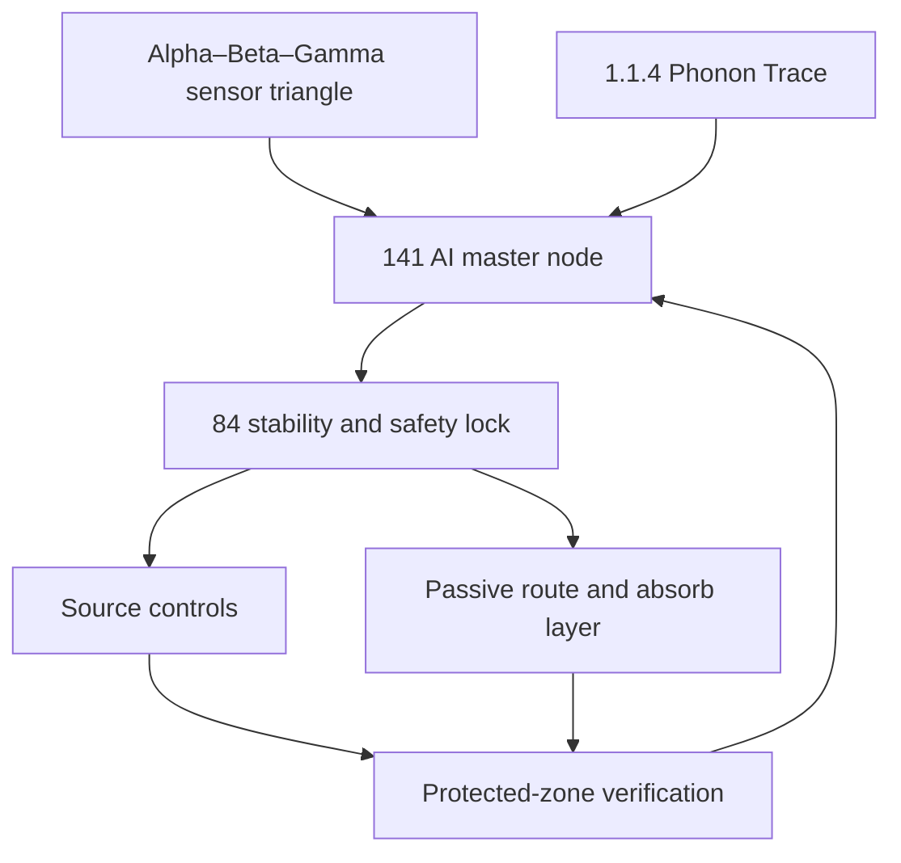

# Static Coherence RF Control System

## AI-controlled sensing, routing, absorption, and experimental validation

**Project status:** engineering design plus exploratory research framework  
**Primary purpose:** reduce unnecessary radiofrequency (RF) exposure in occupied spaces without jamming communications, making medical claims, or using dangerous materials  
**Core rule:** every claimed effect must be tied to a calibrated measurement

---

## 1. Design statement

Static Coherence is a closed-loop environmental control system. It does not attempt to turn radio waves into food or matter. It measures an electromagnetic field, identifies controllable sources, lowers or reroutes transmissions where possible, and sends remaining RF energy toward passive absorbers or away from a defined protected zone.

Kris's tree-cloud observation becomes the system's guiding analogy:

> A tree releases a distributed chemical field. That field interacts with surrounding air, and some emitted compounds can become particles that influence cloud formation. Static Coherence asks whether an engineered distributed field can similarly create a controllable boundary around a protected space.

The natural process is supported at the atmospheric-chemistry level: vegetation emits biogenic volatile organic compounds; oxidation can turn some of them into secondary organic aerosol, and those particles can contribute to cloud-condensation nuclei. This is **not evidence that trees vacuum up RF energy**. It is a useful model for distributed capture, conversion, and feedback. See [Zhao et al., Nature Communications (2017)](https://www.nature.com/articles/ncomms14067), [Dada et al. (2023), NOAA-hosted paper](https://repository.library.noaa.gov/view/noaa/59267/noaa_59267_DS1.pdf), and [NOAA SENEX](https://csl.noaa.gov/projects/senex/whitepaper.pdf).

---

## 2. What “pull in and expel” means physically

The project uses these words in measurable engineering terms:

| Project term | Physical implementation | Observable result |
| --- | --- | --- |
| Pull in | Couple incident RF into an antenna, conductive surface, absorber, or shield | Lower field strength behind the structure; measurable absorbed/reflected energy |
| Hold | Temporarily store sampled signal data or a tiny amount of electromagnetic energy in ordinary capacitive/inductive elements | Logged waveform or measured voltage/current |
| Convert | Dissipate coupled RF as extremely small amounts of heat in a resistive absorber, or rectify it into very small electrical power | Temperature/power change above instrument noise |
| Expel | Reflect or redirect energy away from the protected zone; reduce the original transmitter's duty cycle; move traffic to a wired path | Lower time-averaged field in the protected zone |
| Static coherence | Keep the control system's sensor timing, phase estimates, safety limits, and response state stable | Repeatable sensor readings and deterministic controls |
| Electric quantum reality | An exploratory label for effects below the established model; it earns engineering status only after blinded, repeatable measurement | Pre-registered prediction passes against controls |

RF energy is non-ionizing. For cell phones operating within current exposure limits, the FDA says available scientific evidence has not shown danger to users, although simple exposure-reduction steps remain possible. See the [FDA cell-phone overview](https://www.fda.gov/radiation-emitting-products/home-business-and-entertainment-products/cell-phones).

---

## 3. System architecture



### 3.1 Alpha–Beta–Gamma sensor triangle

Three spatially separated, calibrated RF sensors estimate whether a field is rising, falling, or moving across the protected zone. A fourth reference sensor outside the zone distinguishes a genuine field change from sensor drift.

Each station records:

- time and calibration identity;
- electric-field strength by frequency band;
- received power spectral density;
- temperature and humidity;
- device power and network activity, when available;
- distance and orientation relative to known transmitters.

The triangle is a localization aid, not a medical detector.

### 3.2 1.1.4 Phonon Trace

The Quantum Microphone layer listens for acoustic, mechanical, and electrical signatures that coincide with RF events: fan changes, relay movement, switching-power noise, vibration, and device activity. These “phonon breadcrumbs” help identify the source of an event without claiming that sound itself captures RF.

### 3.3 141 AI master node

The master node fuses the sensor streams and makes a confidence-scored source estimate. Its job is prediction and optimization:

1. detect a sustained rise above the project's conservative target;
2. classify the likely source and band;
3. select the least intrusive lawful response;
4. predict the expected reduction;
5. apply one reversible change;
6. verify the result against the reference sensor;
7. reverse the change when it fails or degrades emergency communications.

No single model output is trusted as proof. Raw sensor data, the chosen action, and before/after readings remain available for review.

### 3.4 84 pilot/stability lock

The 84 node is an independent, simple safety controller. It can reject AI commands. It enforces:

- no transmission intended to block, overpower, spoof, or jam another signal;
- no control of emergency, medical, aviation, navigation, or public-safety communications;
- no action outside certified device settings;
- no high-voltage, radioactive, toxic-metal, aerosol-generation, or human-experiment command;
- immediate return to a passive monitoring state after sensor disagreement, software failure, overheating, or loss of calibration.

Consumer signal jammers are prohibited in the United States and can disrupt emergency calls. The system therefore uses lawful source controls and passive materials only. See the [FCC jammer-enforcement guidance](https://www.fcc.gov/general/jammer-enforcement).

---

## 4. Control actions, in required priority order

The controller always uses the lowest-energy and most reversible action first.

### Mode 0 — Observe

- Collect a baseline without changing the environment.
- Map field strength by band, location, time, and known device activity.
- Reject readings that fail calibration or disagree with the reference sensor.

### Mode 1 — Remove avoidable transmission

- Put idle local devices into airplane mode or radios-off mode only through their normal user-approved controls.
- Disable unused Bluetooth, Wi-Fi, hotspot, or cellular functions.
- Move large data transfers to wired Ethernet or USB when available.
- Buffer nonurgent traffic and transmit it in shorter scheduled periods.

### Mode 2 — Reduce at the source

- Use only manufacturer-supported transmitter-power, access-point, and duty-cycle settings.
- Prefer the nearest suitable access point so devices do not increase their own transmit power trying to reach a weak signal.
- Never partly shield an active phone without testing: a weakened connection can cause the phone to raise its transmit power.

### Mode 3 — Create a protected geometry

- Move transmitters away from the occupied zone.
- Place professionally characterized passive absorber or reflector panels so their low-field side faces the protected zone.
- Verify the full room rather than assuming that a panel's advertised material guarantees protection.
- Keep airflow, heat dissipation, exits, alarms, and equipment function unchanged.

### Mode 4 — Route and dissipate

- Couple energy intercepted by a passive receiving surface into a characterized resistive termination.
- Measure the coupled power; expect it to be very small in an ordinary room.
- Treat “expulsion” as redirection away from people or dissipation as heat—not disappearance of energy.

### Mode 5 — Experimental coherent boundary

This mode exists in simulation and a shielded laboratory test fixture only. It evaluates whether multiple passive or very-low-power controllable elements can create a repeatable low-field pocket through phase-aware reflection.

It must not radiate into public spectrum, cancel a neighbor's service, or operate as an unlicensed jammer. Active cancellation is narrowband, geometry-sensitive, and capable of creating higher-field locations elsewhere; it is not approved for an occupied-room prototype.

---

## 5. Tree-cloud capture layer

The nature-inspired portion is implemented as a **distributed sensor-and-surface canopy**, not as an inhalable dust or chemical release.

### Canopy structure

- many small passive sensing/coupling cells rather than one strong emitter;
- branching placement modeled after a tree crown to sample several heights and directions;
- a trunk bus carrying power, timing, and data;
- a root/reference plane establishing electrical ground and calibration reference;
- AI selection of which passive surface geometry best lowers the field inside the protected zone.

### What the canopy tests

1. Whether distributed placement produces a more uniform low-field region than a single panel.
2. Whether the response remains stable as people and devices move.
3. Whether absorbed or redirected energy accounts for the measured field change.
4. Whether the change vanishes when the canopy is replaced by a visually identical nonconductive control.

### What it does not claim

- that tree aerosols absorb cell-phone radiation;
- that biological emissions create a vacuum;
- that quantum effects have been demonstrated at room scale;
- that lowering an already compliant field produces a medical benefit.

---

## 6. Static Programming and Intent Mask

Each test article receives a digital Intent Mask before activation:

```yaml
intent: protect_occupied_zone
allowed_actions:
  - measure
  - request_user_approved_radio_setting
  - select_wired_route
  - reposition_local_source
  - configure_passive_surface
forbidden_actions:
  - jam
  - spoof
  - overpower
  - target_person
  - interfere_with_emergency_service
  - generate_aerosol
  - use_radioactive_or_toxic_material
rollback: passive_monitoring
```

The earlier Static Programming sequence is retained in safe form:

1. identify the test material and record mass/dimensions;
2. record conductivity, RF properties, polarity, and environmental conditions;
3. attach the Intent Mask and test ID;
4. isolate the test fixture;
5. apply only approved low-energy signals inside the fixture;
6. measure before/after response;
7. compare with sham and no-material controls;
8. archive raw results whether they support or reject the theory.

The earlier material names—Copper carrier, Silver refinement layer, hydrogen memory field, 46–49 weave, Polonium-84 well, Mercury mirror, Cadmium damping, and Indium containment—remain useful as simulation labels. **Polonium, mercury, cadmium, compressed hydrogen, fluorine, lead, and other hazardous substances are excluded from a physical prototype.** Their proposed functions must be represented with safe commercial RF materials or software models.

---

## 7. AI control logic

```text
loop once per control interval:
    read all calibrated sensors
    if calibration invalid or sensors disagree:
        enter PASSIVE_SAFE state

    estimate field map and uncertainty
    identify only user-owned, controllable sources

    if exposure target is satisfied:
        keep observing; do not add energy
    else:
        rank lawful actions by:
            predicted reduction
            reversibility
            communication impact
            energy cost
            uncertainty

        request approval for any user-visible connectivity change
        apply one action
        measure before/after difference against reference sensor

        if protected-zone field falls without raising another zone:
            retain action and log evidence
        else:
            rollback immediately
```

The optimizer's objective is:

\[
J = w_1 E_{zone} + w_2 E_{peak} + w_3 D_{communication} + w_4 P_{control} + w_5 U
\]

where \(E_{zone}\) is time-averaged field in the protected zone, \(E_{peak}\) is the worst verified local peak, \(D_{communication}\) is lost service, \(P_{control}\) is added control power, and \(U\) is measurement uncertainty. The controller minimizes \(J\) while the 84 lock enforces hard safety constraints.

---

## 8. Falsifiable “electric quantum reality” research track

This track protects the idea from being dismissed prematurely while also protecting it from being declared successful without evidence.

### Hypothesis EQ-1

A distributed electrically biased but non-radiating surface produces a larger protected-zone RF reduction than predicted by its ordinary conductivity, geometry, and dielectric properties.

### Required experiment

- enclosed RF test fixture operated by a qualified laboratory;
- stable legal test source or contained signal generator;
- calibrated field probes;
- active article, unbiased article, sham article, and empty-fixture control;
- randomized test order hidden from the analyst;
- pre-registered frequency, distance, field, temperature, and pass/fail threshold;
- enough repeated trials to estimate normal variation;
- energy accounting and thermal monitoring.

### Pass condition

The effect must be larger than combined instrument uncertainty, repeat across days and operators, survive the sham comparison, and be reproduced independently.

### Interpretation

- If ordinary electromagnetic simulation predicts the result, it is a successful engineering design.
- If a repeatable residual remains, it becomes a new research question.
- If the result fails, the log still improves the design by ruling out a mechanism.

---

## 9. Verification plan

| Phase | Test | Acceptance requirement |
| --- | --- | --- |
| 1 | Sensor calibration | Readings traceable to a known reference; uncertainty recorded |
| 2 | Empty-room baseline | Repeatable map over time with devices labeled |
| 3 | Source-control test | Field reduction matches device state change and reverses on rollback |
| 4 | Passive-panel test | Lower protected-zone field without a new higher occupied-zone peak |
| 5 | Canopy comparison | Distributed canopy compared with equal-area single panel and sham |
| 6 | AI closed loop | No unsafe command; every action verified or rolled back |
| 7 | Independent review | RF engineer reviews data, compliance, and measurement method |

No prototype is called protective, therapeutic, or medical based on a phone app, uncalibrated meter, a single trial, or subjective sensation.

---

## 10. Practical first prototype

The first version is intentionally non-radiating:

1. four calibrated sensing locations forming Alpha, Beta, Gamma, and Reference;
2. a local controller running the 141 estimator;
3. an independent 84 safety controller with physical power cutoff;
4. software connectors to user-owned router/device settings;
5. a wired-network preference controller;
6. movable passive test panels with documented RF properties;
7. temperature, air-quality, and equipment-status monitoring;
8. a dashboard showing source, frequency band, confidence, chosen response, and measured before/after field;
9. immutable timestamped experiment logs;
10. a simulation-only workspace for coherent surfaces and exploratory quantum hypotheses.

This version can establish whether the AI control loop and tree-canopy geometry reduce a measured field. It does not need radioactive materials, dangerous voltages, chemical clouds, or an unlicensed transmitter.

---

## 11. Meaning of success

Static Coherence succeeds when it can repeatedly demonstrate all of the following:

- it correctly identifies controllable RF sources;
- it lowers measured fields inside a chosen zone using lawful, reversible controls;
- it does not create a larger peak somewhere else people occupy;
- it preserves required communications and emergency access;
- it distinguishes measured engineering effects from exploratory theory;
- it records enough evidence for another laboratory to reproduce the result.

The strongest form of this idea is not an invisible promise. It is an AI-governed environmental system whose protection claim is continuously checked by independent sensors.

---

## 12. Immediate health boundary

This system is a research and environmental-control project, not a substitute for medical care. If anyone experiences new neurological symptoms, burns, fainting, chest pain, severe headache, weakness, or concerns involving an implanted device, the correct action is medical evaluation rather than attempting an RF experiment. The FDA specifically advises keeping consumer electronics with strong magnets at least six inches from implanted medical devices and discussing symptoms or concerns with a healthcare professional: [FDA implanted-device guidance](https://www.fda.gov/radiation-emitting-products/cell-phones/magnets-cell-phones-and-smart-watches-may-affect-pacemakers-and-other-implanted-medical-devices).
